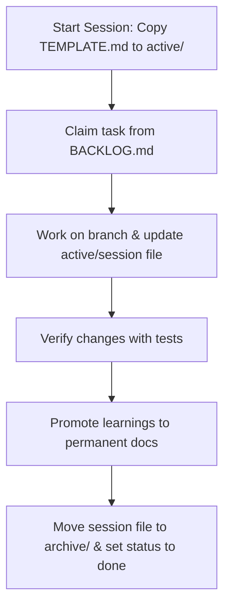

# Project Agent Memory Template

A structured, tiered memory and guidelines framework designed for AI coding agents (such as Claude, GPT, Gemini, or specialized IDE agents). This template prevents agent context bloat, reduces branch conflicts in multi-agent environments, establishes strict coding guardrails, and maintains evergreen documentation.

---

## The Core Philosophy (ADR-001)

Traditionally, agents use a single large state file (e.g., `STATE.md` or `MEMORY.md`) to track progress and context. However, single-file approaches:

1. **Grow unbounded**, consuming the agent's context window.
2. **Cause merge conflicts** when multiple agents work on different branches.
3. **Lose history** when logs are trimmed to save space.
4. **Mix lifecycles**, putting high-level architecture rules in the same file as transient scratchpad notes.

This template solves these problems by splitting memory by **lifecycle and scope** into a structured hierarchy.

---

## Tiered Memory Structure

```
├── CLAUDE.md                   # Agent entry point (tells agent to read AGENTS.md first)
├── AGENTS.md                   # Strict guidelines, coding standards, and the wiki read-gate
├── .claude/
│   └── commands/
│       └── next.md             # Claude command for continuing the next task/session
├── .agents/
│   └── skills/                 # Custom framework-specific instruction sets/skills
└── docs/
    ├── ARCHITECTURE.md         # The system map, tech stack, and module layout
    ├── ROADMAP.md              # Milestone phases with concrete done-criteria
    ├── BACKLOG.md              # Active task queue and unresolved questions
    ├── DECISIONS.md            # ADRs (Architectural Decision Records) capturing "why" decisions
    ├── wiki/                   # Deep-dive scoped guides + index.md catalog (loaded only when needed)
    └── sessions/               # Episodic plans and progress tracking
        ├── TEMPLATE.md         # Session blueprint
        ├── active/             # In-flight sessions (one file/branch per task)
        └── archive/            # Log of completed sessions
```

### 1. The Entry Points

- **[CLAUDE.md](./CLAUDE.md)**: The gatekeeper. Instructs the agent to immediately read [AGENTS.md](./AGENTS.md) before starting any task.
- **[AGENTS.md](./AGENTS.md)**: The central operating rules. Contains coding guidelines (e.g., Simplicity First, Surgical Changes), guardrails, gotchas, and the wiki read-gate (the catalog itself lives in `docs/wiki/index.md`, loaded on demand). **This file is always loaded at the start of every session.**

### 2. High-Level Direction

- **[docs/ROADMAP.md](./docs/ROADMAP.md)**: The long-term plan divided into production-ready phases. Helps the agent understand what phase the project is in and what the concrete completion criteria are.
- **[docs/BACKLOG.md](./docs/BACKLOG.md)**: The short-term task queue and list of open questions. Agents claim items here but do not modify this file to do so (avoiding branch conflicts).

### 3. System Design & Architectural Rationale

- **[docs/ARCHITECTURE.md](./docs/ARCHITECTURE.md)**: Defines the tech stack, module responsibilities, folder structures, and key data flow models.
- **[docs/DECISIONS.md](./docs/DECISIONS.md)**: An append-only log of Architectural Decision Records (ADRs). Helps agents understand the rationale behind past decisions and tech choices.

### 4. Deep-Dives

- **[docs/wiki/](./docs/wiki/)**: Scoped, topic-specific knowledge bases (e.g., `auth.md`, `testing.md`) in OKF format (YAML frontmatter + structured body). Cataloged in [docs/wiki/index.md](./docs/wiki/index.md) and reached via [AGENTS.md](./AGENTS.md)'s read-gate; only read when the agent's task touches that specific module.

### 5. Episodic State & Concurrency Control

- **[docs/sessions/](./docs/sessions/)**: A folder containing episodic session files.
  - **active/**: Contains active session files (e.g., `active/2026-06-04-implement-auth.md`). Each session corresponds to exactly one git branch/task. Agents write logs and keep their handoff notes here, which prevents parallel work on different branches from causing merge conflicts in memory files.
  - **archive/**: Contains completed sessions, serving as a history of agent activities.

### 6. Claude Commands

- **[.claude/commands/](./.claude/commands/)**: Repo-local Claude commands that package common workflows into reusable slash commands.
  - **[next.md](./.claude/commands/next.md)**: Continues development by following `AGENTS.md`, choosing the next suitable task, announcing the pick before coding, and opening a session file.

### 7. Custom Agent Skills

- **[.agents/skills/](./.agents/skills/)**: Houses customized, reusable instructions and guidelines for the agent to reference when developing components utilizing specific libraries (e.g., Elysia, Better Auth, Svelte).

---

## The Agent-Developer Workflow

Follow this cycle for every task:



### 1. Starting a Session

1. In your working git branch, copy [docs/sessions/TEMPLATE.md](./docs/sessions/TEMPLATE.md) to `docs/sessions/active/YYYY-MM-DD-<slug>.md`.
2. Fill out the `scope` metadata block (claimed backlog items, target files, etc.).
3. Summarize the goal and task breakdown.

### 2. Working and Checkpointing

- As work progresses, append brief timestamps to the **Log** section.
- Keep the **Handoff** section completely up to date. If the session is interrupted or handed over to another agent, they can resume instantly using only this handoff.

### 3. Closing & Promoting Learnings (Required)

Before merging your branch into `main`:

1. Move your session file from `docs/sessions/active/` to `docs/sessions/archive/` and update `status: done` in the frontmatter.
2. Promote permanent knowledge out of your session log to the relevant docs:
   - **Always-true gotchas or rules** → [AGENTS.md](./AGENTS.md)
   - **Scoped how-it-works / domain guides** → `docs/wiki/<topic>.md` (and add to the [AGENTS.md](./AGENTS.md) index)
   - **Durable design choices / ADRs** → [docs/DECISIONS.md](./docs/DECISIONS.md)
   - **Module structural / API updates** → [docs/ARCHITECTURE.md](./docs/ARCHITECTURE.md)
   - **New follow-ups / answered questions** → [docs/BACKLOG.md](./docs/BACKLOG.md)

## Continue Development with `/next`

If your Claude environment supports project commands from `.claude/commands/`, this template includes a reusable `/next` command in [.claude/commands/next.md](./.claude/commands/next.md) to help resume work with minimal prompting.

### What `/next` does

- Reads [AGENTS.md](./AGENTS.md), [docs/BACKLOG.md](./docs/BACKLOG.md), [docs/ROADMAP.md](./docs/ROADMAP.md), and the active session list before choosing work.
- Uses your explicit argument if you provide one; otherwise it picks the next task based on the current phase and deferred-item rules in `AGENTS.md`.
- Tells you what it picked and why **before** coding.
- Asks you to choose if there are multiple equally reasonable candidates.
- Opens a new session file under `docs/sessions/active/`.
- Follows the repo's test-first and close-out workflow.

### Usage

Start the next appropriate task automatically:

```text
/next
```

Tell Claude exactly what to continue or work on:

```text
/next Task 2: Configure database schema and migrations
```

This is especially useful when starting a fresh Claude conversation or resuming after a context reset.

---

## Adoption Guide

To adopt this template in your repository:

1. Copy the `CLAUDE.md`, `AGENTS.md`, `.claude/`, `.agents/`, and `docs/` directories to your project's root.
2. Edit [docs/ARCHITECTURE.md](./docs/ARCHITECTURE.md) and customize the technology stack table, module layout, and core business entities.
3. Edit [AGENTS.md](./AGENTS.md) and adapt the coding guidelines and guardrails to suit your codebase standards.
4. Populate [docs/ROADMAP.md](./docs/ROADMAP.md) and [docs/BACKLOG.md](./docs/BACKLOG.md) with your project roadmap phases and task backlog.
5. Instruct your AI agent (in system prompts or via custom instructions) to read [CLAUDE.md](./CLAUDE.md) first.

---

## Bootstrap Prompt for AI Coders

When starting a new project using this template, clone this repository and copy/paste this prompt (filling in your project details) to your AI coder. This kicks off the initialization and fills in all template files based on your requirements:

```markdown
I am starting a new project. Here is the description and requirements for what I want to build:

---
[INSERT YOUR PROJECT DESCRIPTION, TECH STACK PREFERENCES, AND REQUIREMENTS HERE]
---

Please bootstrap this project based on the template structure:
1. Read the current CLAUDE.md and AGENTS.md files to understand the project structure and rules.
2. Delete the root README.md file (which contains template setup instructions) so we can start clean.
3. Review and initialize the core project files under the docs/ directory by replacing the placeholder templates with actual content tailored to the project description above:
   - Edit docs/ARCHITECTURE.md to reflect our proposed tech stack, directory layout, and core business entities.
   - Edit docs/ROADMAP.md and docs/BACKLOG.md to define our project phases, done-criteria, and immediate tasks.
   - Edit docs/DECISIONS.md to record our initial architecture decision records (ADRs).
   - Adapt AGENTS.md with specific coding guidelines, guardrails, and conventions for our selected tech stack.
4. Create a new active session file under docs/sessions/active/ to track this bootstrapping work.
5. Present the initialized architecture and roadmap plan to me for approval.
```

---

## Custom Agent Skills

This template includes a system for provisioning reusable agent skills (located in `.agents/skills/`) to guide the AI coder on specific frameworks, libraries, and best practices (such as Svelte 5, ElysiaJS, or Better Auth).

### Skill Indexing
To avoid the agent reading all skill files unnecessarily—which wastes context and increases costs—all available skills are indexed in [AGENTS.md](./AGENTS.md) under the `## Agent Skills Index` section. 

When an agent starts a task, it scans the index. If the task relates to a topic handled by one of the skills, the agent will dynamically load and read only that specific `SKILL.md` file.

> [!TIP]
> If your IDE or AI coding assistant has native skill detection that automatically dynamically loads `.agents/skills`, you can safely delete the index section in [AGENTS.md](./AGENTS.md) to save context.

### How to Use a Skill (Sample User Request)

To leverage these skills, simply point your AI coder to the relevant skill in your prompt:

```markdown
I want to add email verification to our signup page. 
Please read the `email-and-password-best-practices` skill before editing any code.
```

The agent will then:
1. Lookup the path from the index in [AGENTS.md](./AGENTS.md).
2. Load and read the instructions, configuration rules, and code patterns in `.agents/skills/email-and-password-best-practices/SKILL.md`.
3. Surgically implement the email verification flow following those best practices.

### Managing Skills (`skills-lock.json`)
The skills in `.agents/skills/` are tracked via the [skills-lock.json](./skills-lock.json) lockfile. This file records the source repository, path, and version hash of each skill, making it easy to sync, update, or share skills across multiple agent-managed workspaces.

---

## License

This template is released under the [Unlicense](./LICENSE) (Public Domain Dedication). You are free to copy, modify, publish, use, or distribute these files in any form, for any purpose, with no conditions or attribution required.


